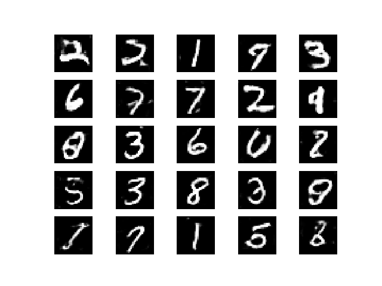

## Trained by google colab

#### the generator and discriminator models' weight has been saved in "models_and_weights" files

#### mnist dataset is in "MNIST_data" file if you want to download


## train our model

```shell
python dcgan_train.py
```


## train model on colab

```shell
using colab and the dcgan.ipynb file
```


## test our model

~~~ shell
python Test_model.py
~~~


### then the picture showed as this:

